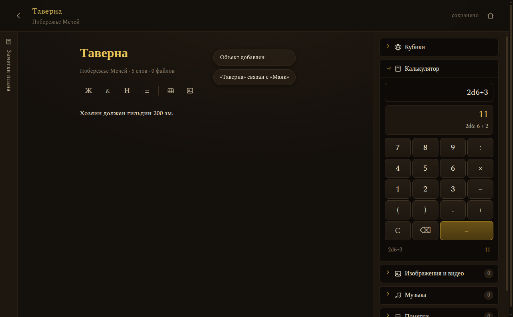

# Journeyman Desktop — кодекс мастера

Настольная версия [Journeyman](https://github.com/KennyS44/Journeyman): хранилище
материалов для мастеров настольных ролевых игр. Обычная программа с ярлыком и
окном — браузер открывать не нужно, интернет не нужен, данные лежат папкой на
диске и никуда не отправляются.

*Снимок сделан автоматической проверкой в настоящем окне Electron.*

## Что уже работает

Перенесены все возможности веб-версии: пространства, холст с карточками и
связями, редактор текста с таблицами и картинками, галерея, музыка с
мини-плеером, пометки, кубики, калькулятор бросков, заметки плана.

Что появилось именно в настольной версии:

- **Данные — обычные файлы.** `db.json` с записями и папка `assets` с
  картинками, музыкой и видео. Папку можно скопировать на флешку — это и есть
  резервная копия. Меню «Файл → Показать папку с данными» открывает её.
- **Работает без интернета.** Шрифты вшиты в программу, из сети не грузится
  ничего.
- **Окно помнит размер и положение** между запусками; вторая копия программы не
  запускается, чтобы две не писали в одни файлы.
- **Меню с горячими клавишами** для правки текста, масштаба и полноэкранного
  режима.

## Установка

Готовые сборки — на странице [Releases](../../releases/latest). Для Windows
10/11 (64 бита) достаточно одного файла на выбор:

- [Journeyman-Setup-0.1.0.exe](../../releases/download/v0.1.0/Journeyman-Setup-0.1.0.exe)
  — установщик с ярлыком в «Пуске» и на рабочем столе;
- [Journeyman-Portable-0.1.0.exe](../../releases/download/v0.1.0/Journeyman-Portable-0.1.0.exe)
  — без установки, запускается прямо из файла.

Установщик неподписанный, поэтому при первом запуске Windows покажет окно
«Система Windows защитила ваш компьютер»: **«Подробнее»** →
**«Выполнить в любом случае»**.

Данные окажутся в `%APPDATA%\Journeyman\data` — эту папку можно копировать
целиком как резервную копию.

Сборки под Linux (`.AppImage`) и промежуточные версии лежат в артефактах
[Actions](../../actions).

## Разработка

    npm install
    npm start              # запустить программу
    npm test               # парсер выражений + хранилище (18 + 48 проверок)
    npm run test:renderer   # все три экрана поверх настоящего хранилища
    npm run test:ui         # настоящее окно Electron (нужен рабочий стол или xvfb)
    npm run dist:win        # собрать установщик под Windows
    npm run dist:linux      # собрать AppImage

## Как устроено

    src/main/main.js       главный процесс: окно, меню, мост к хранилищу
    src/main/storage.js    записи в db.json, файлы в assets/ — без браузера и БД
    src/preload.js         единственная дверь между экранами и диском
    src/renderer/          интерфейс: тот же, что в веб-версии
      js/db.js             адаптер: интерфейс DB веб-версии поверх файлов
      js/ui.js, calc.js    помощники и парсер выражений — перенесены дословно
      js/app.js, screens/  оболочка и три экрана — перенесены дословно
      css/, fonts/         оформление и вшитые шрифты
    tests/                 тесты парсера, хранилища и два прогона интерфейса

Главное решение переноса: экраны не тронуты вообще. Слой хранения веб-версии
(`DB` поверх IndexedDB) заменён адаптером с теми же именами методов и той же
формой ответа, а сами данные пишет главный процесс. Подробности и список
отличий — в [docs/PORTING.md](docs/PORTING.md).

## Перенос материалов из браузерной версии

Пока не сделан: браузер не отдаёт свою базу наружу без экспорта, а экспорта в
веб-версии ещё нет. Задача записана в [docs/PORTING.md](docs/PORTING.md) —
сначала экспорт в файл на стороне сайта, затем импорт этого файла здесь.

## Лицензии

Код — MIT (см. `LICENSE`). Шрифты Cinzel и Spectral — SIL Open Font License 1.1,
тексты лежат рядом со шрифтами в `src/renderer/fonts`.
